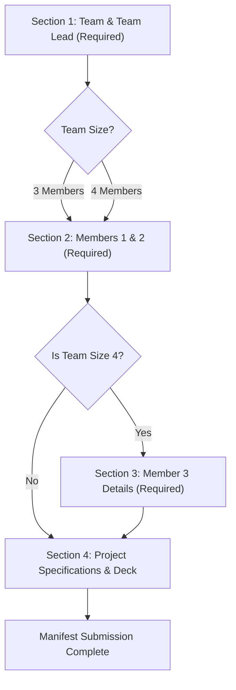

# SEDHACKS '26 — Phase 1 Registration Google Form Specification
**Host Division:** SEDS REC (Students for the Exploration and Development of Space, Rajalakshmi Engineering College)  
**Event:** SEDHACKS '26 — Student Space & Technology Hackathon  
**Tagline:** Innovate. Build. Explore Beyond the Sky.  
**Dates:** 12–13 October 2026  
**Venue:** Rajalakshmi Engineering College, Chennai  
**Phase:** Phase 1 Initial Submission (100% Free)  
**Target Audience:** University Engineering & Science Students (Teams of 3–4)

---

## 1. Google Form Administrative Setup & Global Settings

| Setting Option | Recommended Configuration | Purpose / Notes |
| :--- | :--- | :--- |
| **Form Title** | `SEDHACKS '26 — Phase 1 Project Registration \| SEDS REC` | Clear event branding and official chapter affiliation |
| **Responses → Collect Email Addresses** | **Verified** or **Responder Input** | Ensures email receipt and contact integrity |
| **Responses → Send Responders a Copy** | **Always** | Provides applicants with instant submission proof |
| **Responses → Allow Response Editing** | **Turn ON** *(until submission deadline)* | Allows teams to update presentation decks or typos |
| **Responses → Limit to 1 Response** | **Turn ON** (Requires Google Sign-in) | Prevents accidental duplicate submissions |
| **Presentation → Confirmation Message** | *(See confirmation text below)* | Gives next steps regarding evaluation & Phase 2 |
| **File Upload Destination** | Dedicated Google Drive Folder: `SEDHACKS_26_PHASE_1_DECKS` | Ensures organized collection of candidate slides |

### Official Form Header Description
```text
SEDHACKS '26 is the premier student space and technology hackathon organized by SEDS REC at Rajalakshmi Engineering College, Chennai, conducted with industry collaboration from Aeroin Space Tech.

MISSION DIRECTIVES:
• Phase 1 Registration: 100% FREE.
• Team Size: Strictly 3 to 4 members (1 Team Lead + 2 or 3 Members).
• Evaluation: The SEDS REC review panel and domain experts will review all proposals and shortlist approximately 30 teams.
• Phase 2: Shortlisted teams will be invited to the final sprint at REC Chennai (Registration fee: ₹300 per person).
• Prize Pool: ₹10,000 cash prizes + Internship opportunities for Top 3 teams through Aeroin Space Tech.

All submissions are evaluated on engineering rigor, feasibility, and innovation across space, technology and sustainability.
```

---

## 2. Form Structure & Section Breakdown



---

## 3. Section-by-Section Field Details

### SECTION 1: Team Identification & Team Lead (Primary Contact)

| # | Field Title / Prompt | Question Type | Response Validation / Options | Required? |
| :-: | :--- | :--- | :--- | :-: |
| 1.1 | **Team Name** | Short answer | Text (Minimum length: 2 characters) | **Yes** |
| 1.2 | **Institution / College Name** | Short answer | Text (e.g., *Rajalakshmi Engineering College*) | **Yes** |
| 1.3 | **Team Lead — Full Name** | Short answer | Text | **Yes** |
| 1.4 | **Team Lead — Official / College Email** | Short answer | Text → **Email address** | **Yes** |
| 1.5 | **Team Lead — WhatsApp / Contact Number** | Short answer | Regular Expression or Number → `^[0-9]{10}$` | **Yes** |
| 1.6 | **Team Lead — Academic Year** | Multiple choice | • 1st Year<br>• 2nd Year<br>• 3rd Year<br>• 4th Year<br>• Postgraduate (M.E. / M.Tech / M.Sc) | **Yes** |
| 1.7 | **Team Lead — Department** | Short answer | Text (e.g., *Aerospace Engineering*, *CSE*, *ECE*) | **Yes** |
| 1.8 | **Total Crew Size (Including Team Lead)** | Multiple choice | • `3 Members (Lead + 2 Members)`<br>• `4 Members (Lead + 3 Members)` | **Yes** |

---

### SECTION 2: Mandatory Crew Members (Members 1 & 2)

#### Crew Member 1
| # | Field Title / Prompt | Question Type | Response Validation / Options | Required? |
| :-: | :--- | :--- | :--- | :-: |
| 2.1 | **Member 1 — Full Name** | Short answer | Text | **Yes** |
| 2.2 | **Member 1 — Email Address** | Short answer | Text → **Email address** | **Yes** |
| 2.3 | **Member 1 — Academic Year** | Dropdown | `1st Year`, `2nd Year`, `3rd Year`, `4th Year`, `PG` | **Yes** |
| 2.4 | **Member 1 — Department** | Short answer | Text | **Yes** |

#### Crew Member 2
| # | Field Title / Prompt | Question Type | Response Validation / Options | Required? |
| :-: | :--- | :--- | :--- | :-: |
| 2.5 | **Member 2 — Full Name** | Short answer | Text | **Yes** |
| 2.6 | **Member 2 — Email Address** | Short answer | Text → **Email address** | **Yes** |
| 2.7 | **Member 2 — Academic Year** | Dropdown | `1st Year`, `2nd Year`, `3rd Year`, `4th Year`, `PG` | **Yes** |
| 2.8 | **Member 2 — Department** | Short answer | Text | **Yes** |

---

### SECTION 3: Additional Crew Member (Member 3 — For 4-Member Teams)
*Configure Section 2 navigation: If team size is 3, skip this section and jump directly to Section 4.*

| # | Field Title / Prompt | Question Type | Response Validation / Options | Required? |
| :-: | :--- | :--- | :--- | :-: |
| 3.1 | **Member 3 — Full Name** | Short answer | Text | **Yes** *(if in section 3)* |
| 3.2 | **Member 3 — Email Address** | Short answer | Text → **Email address** | **Yes** |
| 3.3 | **Member 3 — Academic Year** | Dropdown | `1st Year`, `2nd Year`, `3rd Year`, `4th Year`, `PG` | **Yes** |
| 3.4 | **Member 3 — Department** | Short answer | Text | **Yes** |

---

### SECTION 4: Project Proposal & Technical Specifications

| # | Field Title / Prompt | Question Type | Response Validation / Options | Required? |
| :-: | :--- | :--- | :--- | :-: |
| 4.1 | **Challenge Domain / Track** | Dropdown | 1. `Track 01: Space Applications & Defence Technology`<br>2. `Track 02: Medical, Food & Agriculture in Space`<br>3. `Track 03: Autonomous & Communication Technology`<br>4. `Track 04: Sustainability in Space`<br>5. `Track 05: Miscellaneous / Open Innovation` | **Yes** |
| 4.2 | **Project Title** | Short answer | Text (Concise name of proposed system) | **Yes** |
| 4.3 | **Project Abstract & Technical Approach** | Paragraph | Text (Minimum 50 words / ~250 characters)<br>*Description: Outline the problem statement, proposed hardware/software architecture, and expected mission output.* | **Yes** |
| 4.4 | **Upload Technical Presentation Deck** | **File upload** | • Allow specific file types: **Presentation (.ppt, .pptx)** and **PDF**<br>• Maximum number of files: **1**<br>• Maximum file size: **100 MB** | **Yes** |
| 4.5 | **Alternate Presentation Link (Google Drive / OneDrive)** | Short answer | Text → **URL**<br>*Description: Optional backup link with 'Anyone with the link can view' access in case file upload encounters network restrictions.* | Optional |

---

## 4. Submission Confirmation Message
Paste this under **Settings → Presentation → Confirmation message**:

```text
✓ Phase 1 Application Recorded.

Your preliminary project submission for SEDHACKS '26 has been received by SEDS REC.

NEXT PHASES:
1. Technical Evaluation: The SEDS REC review panel and domain mentors are evaluating all submissions.
2. Shortlist Announcement: Approximately 30 shortlisted teams will be officially announced and notified via email.
3. Phase 2 Registration: Shortlisted teams will unlock the final sprint entry (₹300 per person).

For inquiries, contact the SEDS REC organizing committee at sedsrec@rajalakshmi.edu.in or queries.sedshacks@gmail.com.
```
